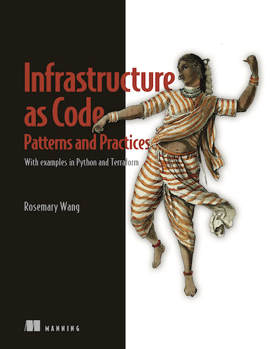

<!-- Main -->

    <!-- One -->
    <section id="one">
        

            <header class="major">
                <h1>Writing</h1>
            </header>
            

                

                    <h3>Books</h3>
                    <h4>Infrastructure as Code, Patterns & Practices</h4>
                    
                

            

            

                

                    <h3>Blog</h3>
                    <ul class="icons">
                        <li><a href="https://medium.com/@joatmon08" target="_blank" class="icon alt fa-medium">Medium</a></li>
                    </ul>
                

            

            

                

                    <h3>Articles</h3>
                    
Below are additional articles published outside of my personal blog.

                    <ul class="unordered">
                        <li><a href="https://www.hashicorp.com/en/blog/protect-data-privacy-in-amazon-bedrock-with-vault" target="_blank">Protect data privacy in Amazon Bedrock with Vault</a></li>
                        <li><a href="https://www.hashicorp.com/en/blog/patterns-to-refactor-infrastructure-as-code-for-compliance" target="_blank">Patterns to refactor infrastructure as code for compliance</a></li>
                        <li><a href="https://www.hashicorp.com/blog/reload-ssl-certificates-from-hashicorp-vault-for-spring-boots" target="_blank">Reload SSL certificates from HashiCorp Vault for Spring Boot</a></li>
                        <li><a href="https://www.hashicorp.com/blog/5-steps-to-set-up-vault-for-widespread-adoption-at-your-orgs" target="_blank">5 steps to set up Vault for widespread adoption at your org</a></li>
                        <li><a href="https://www.hashicorp.com/blog/kubernetes-secrets-management-with-hcp-vault-secrets" target="_blank">Kubernetes secrets management with HCP Vault Secrets</a></li>
                        <li><a href="https://www.hashicorp.com/blog/use-vault-to-manage-api-tokens-for-the-terraform-cloud-operator" target="_blank">Use Vault to manage API tokens for the Terraform Cloud Operator</a></li>
                        <li><a href="https://www.hashicorp.com/blog/how-i-use-boundary-to-build-automation-for-live-streams" target="_blank">How I use Boundary to build automation for live streams</a></li>
                        <li><a href="https://www.hashicorp.com/blog/installing-hashicorp-tools-in-alpine-linux-containers" target="_blank">Installing HashiCorp tools in Alpine Linux containers</a></li>
                        <li><a href="https://www.hashicorp.com/blog/deploy-consul-cluster-peering-locally-with-minikube" target="_blank">Deploy Consul cluster peering locally with Minikube</a></li>
                        <li><a href="https://www.hashicorp.com/blog/using-consul-s-transparent-proxy-on-virtual-machines" target="_blank">Using Consul’s transparent proxy on virtual machines</a></li>
                        <li><a href="https://www.hashicorp.com/blog/refresh-secrets-for-kubernetes-applications-with-vault-agent" target="_blank">Refresh Secrets for Kubernetes Applications with Vault Agent</a></li>
                        <li><a href="https://www.hashicorp.com/blog/improve-observability-with-opentelemetry-and-consul-service-mesh" target="_blank">Improve Observability with OpenTelemetry and Consul Service Mesh</a></li>
                        <li><a href="https://www.hashicorp.com/blog/manage-kubernetes-secrets-for-flux-with-hashicorp-vault" target="_blank">Manage Kubernetes Secrets for Flux with HashiCorp Vault</a></li>
                        <li><a href="https://www.hashicorp.com/blog/using-hashicorp-consul-with-kong-ingress-controller-for-kubernetes" target="_blank">Using HashiCorp Consul with Kong Ingress Controller for Kubernetes</a></li>
                        <li><a href="https://www.hashicorp.com/blog/automated-canary-deployment-with-hashicorp-consul-and-spinnaker" target="_blank">Automated Canary Deployment with HashiCorp Consul and Spinnaker</a></li>
                        <li><a href="https://www.hashicorp.com/blog/testing-hashicorp-terraform" target="_blank">Testing HashiCorp Terraform</a></li>
                        <li><a href="https://www.hashicorp.com/blog/managing-hashicorp-consul-access-control-lists-with-terraform-and-vault" target="_blank">Managing HashiCorp Consul Access Control Lists (ACLs) with Terraform & Vault</a></li>
                        <li><a href="https://www.infoq.cn/article/QMO4tQKKMspZZ6yG3WeI" target="_blank">用容器来学习 Nginx 反向代理 (Chinese Translation of "Using Containers to Learn
                                    Nginx Reverse Proxy", translated by InfoQ China)</a></li>
                        <li><a href="https://www.hashicorp.com/blog/creating-workspaces-with-the-hashicorp-terraform-operator-for-kubernetes/"
                                target="_blank">Creating Workspaces with the HashiCorp Terraform
                                    Operator for Kubernetes</a></li>
                        <li><a href="https://www.hashicorp.com/blog/application-feature-toggles-with-hashicorp-consul/"
                                target="_blank">Application Feature Toggles with Consul</a>
                        </li>
                        <li><a href="https://www.hashicorp.com/blog/tracing-dotnet-applications-with-consul-service-mesh"
                                target="_blank">Tracing .NET Applications with Consul</a>
                        </li>
                        <li><a href="https://www.hashicorp.com/blog/terraform-feature-toggles-blue-green-deployments-canary-test"
                                target="_blank">Feature Toggles, Blue-Green Deployments & Canary
                                    Tests with Terraform</a></li>
                        <li><a href="https://www.hashicorp.com/blog/demonstrating-hashicorp-tools-with-dance-dance-automation/"
                                target="_blank">Demonstrating HashiCorp Tools with Dance Dance
                                    Automation</a></li>
                        <li><a href="https://cloudblogs.microsoft.com/opensource/2019/06/25/how-to-migrate-to-hashicorp-terraform-0-12-microsoft-azure/"
                                target="_blank">Migrating to HashiCorp Terraform 0.12 on Microsoft
                                    Azure</a></li>
                        <li><a href="https://www.hashicorp.com/blog/using-the-kubernetes-and-helm-providers-with-terraform-0-12/"
                                target="_blank">Using the Kubernetes and Helm Providers with
                                    Terraform 0.12</a></li>
                        <li><a href="https://opensource.com/article/17/7/20-sysadmin-commands" target="_blank">20 Linux commands every sysadmin should know</a></li>
                    </ul>
                

            

            

                

                    <h3>Interviews</h3>
                    
Below are interviews.

                    <ul class="unordered">
                        <li><a href="https://thenewstack.io/hashicorp-vault-operator-manages-kubernetes-secrets/" target="_blank">HashiCorp Vault Operator Manages Kubernetes Secrets</a></li>
                        <li><a href="https://gotopia.tech/articles/230/getting-better-at-security-code-quality-and-leveraging-infrastructure-as-code-with-rosemary-wang" target="_blank">Getting Better at Security, Code Quality and Leveraging Infrastructure as Code with Rosemary Wang</a></li>
                    </ul>
                

            

            

                

                    <h3>Podcasts</h3>
                    <ul class="unordered">
                        <li><a href="https://podcast.impostersyndrome.network/2016832/12897434-rosemary-wang" target="_blank">The Imposter Syndrome Network Podcast: Rosemary Wang</a></li>
                        <li><a href="https://www.infoq.com/podcasts/cloud-hosted-cloud-native" target="_blank">InfoQ Podcast: From Cloud-Hosted to Cloud-Native with Rosemary Wang</a></li>
                        <li><a href="https://www.skyflow.com/podcast/introduction-to-zero-trust-infrastructure-with-hashicorps-rosemary-wang" target="_blank">Partially Redacted: Introduction to Zero Trust Infrastructure with Hashicorp’s Rosemary Wang</a></li>
                        <li><a href="https://packetpushers.net/podcast/day-two-cloud-181-implementing-patterns-and-practices-for-infrastructure-as-code/" target="_blank">Day Two Cloud 181: Implementing Patterns And Practices For Infrastructure as Code</a></li>
                        <li><a href="https://spring.io/blog/2022/09/08/a-bootiful-podcast-hashicorp-s-rosemary-wang-on-securing-the-intersection-of-apps-and-ops-with-hashicorp-vault" target="_blank">A Bootiful Podcast: Hashicorp's Rosemary Wang on securing the intersection of apps and ops with Hashicorp Vault</a></li>
                        <li><a href="https://changelog.com/shipit/58" target="_blank">Ship It! – Episode #58: How to keep a secret</a></li>
                        <li><a href="https://developer.confluent.io/podcast/automating-infrastructure-as-code-with-apache-kafka-and-confluent-ft-rosemary-wang" target="_blank">Automating Infrastructure as Code with Apache Kafka and Confluent ft. Rosemary Wang</a></li>
                        <li><a href="https://devchat.tv/adventures-in-devops/essential-infrastructure-as-code-devops-079/" target="_blank">Adventures in DevOps: Essential Infrastructure as Code – DevOps 079</a></li>
                        <li><a href="https://www.devopsparadox.com/episodes/essential-infrastructure-as-code-112/" target="_blank">DevOps Paradox Ep 112: Essential Infrastructure as Code</a></li>
                        <li><a href="https://techstringy.wordpress.com/2019/09/04/infrastructure-as-code-101-rosemary-wang-ep-104/" target="_blank">TechStringy Ep 104: Infrastructure 101</a></li>
                        <li><a href="https://packetpushers.net/podcast/tech-bytes-using-hashicorps-terraform-cloud-for-collaboration-and-governance-sponsored/?doing_wp_cron=1596072923.6274049282073974609375" target="_blank">Packet Pushers: Tech Bytes</a></li>
                        <li><a href="https://devopsspeakeasy.podbean.com/e/devops-speakeasy-podcast-s01e02-rosemary-wang-on-everything-hashicorp/" target="_blank">DevOps Speakeasy S01E02</a></li>
                    </ul>
                

            

            

                

                    <h3>Host & Producer</h3>
                    <ul class="unordered">
                        <li><a href="https://soundcloud.com/hashicast" target="_blank">HashiCast</a></li>
                        <li><a href="https://www.twitch.tv/hashicorplive" target="_blank">HashiCorp Live</a></li>
                        <li><a href="https://www.youtube.com/playlist?list=PL81sUbsFNc5b8i2g2sB_tG-PuZxEdlDpK" target="_blank">Getting into HashiCorp Consul</a></li>
                        <li><a href="https://www.youtube.com/playlist?list=PL81sUbsFNc5YPS-jcIUyJQoJJtg1IIvzc" target="_blank">Getting into HashiCorp Vault</a></li>
                        <li><a href="https://www.youtube.com/playlist?list=PL81sUbsFNc5ZBUgz1Ai7-tfB7qpmqFvEO" target="_blank">Getting into HashiCorp Boundary</a></li>
                        <li><a href="https://www.youtube.com/playlist?list=PL81sUbsFNc5ZWoz3gpCJgUl3H7yZO_iE7" target="_blank">Developer's Guide to HCP Vault</a></li>
                    </ul>
                

            

        

    </section>

